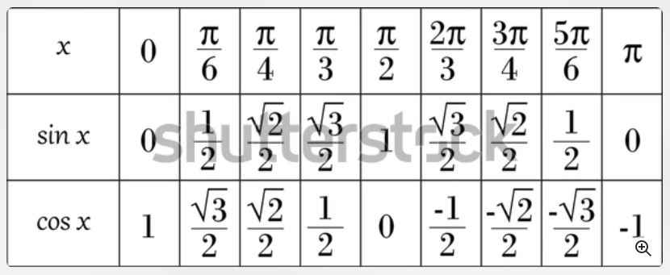

# An attempt to make sure that everybody actually understand the Fourier Transform

1.	Intention: Once, you are done reading this artice, as an author, I want to make sure that I truly put forth my \
	perception of the Fourier Transform. In order to do so, I'll digress from the actual topic and gradually will \
	make my way to the famous Fourier Transform Equation. Without any further a do, let's start the learning!

## Circle

1.	We'll start with circles, the very first question that comes to my mind when I think of circles is \
	"why do 360 degrees make up a circle?". Well, one possible explanation is **360 is the most composite number starting from 1 uptil 360**.\
	So, what a composite number is? Hmm, a prime number is something that is divisible only by itself and one. However,
	**a composite number is something that is divisible by itself, one and some other numbers as well**. 

2.	These are the numbers 360 is divisible by:
		
		1,2,3,4,5,6,8,9,10,12,15,18,20,24,30,36,40,45,60,72,90,120,180 and 360
		
3.	360 being a very composite number simplifies a lot of our calculations. Humans are very good at dealing with **Integer values**, hence, this could be a possible reason for a circle to have 360 degrees

## cosΘ and sinΘ

1.	Now that we understand "why circle has 360 degrees?". Let us now see "what role do cosΘ and sinΘ play?" Let us look at these values first.
	

# Concepts to understand

1.	Euler's Identity

2.	Equation of circle

3.	With only natural numbers, x+1=0 would be unsolvable, unless we introduce integers. \
	Now, despite the knowledge of both natural numbers and integers, the equation 2x-1=8 \
	would be unsolvable without introducing rational numbers. \
	The equation x^2=3 would be unsolvable without irrational numbers. \
	And finally, x^2+1=0 would be unsolvable without imaginary numbers.

4.	A peculiar pattern can be observed each time we multiply a real number with i \
	Graphically, the product x.i.i.i...represents a counterclockwise rotation \
	of a vector of size x by 90ยบ each time an i is multiplied to it. \
	If we assume the value of x to be 1, only 4 vectors repeatedly emerge: \
	i, -1, -i and 1; a quarter of a circle, a semi-circle, a three-quarter circle and a full circle. \
	
5.	360 is highly composite

6.	Pythagoras Theorem is basically point in a plane
	-	distance along x-axis (cos) + distance along y-axis (sin)
	
7.	Pythagoras theorem is used to find the radius of the circle whose center is at the origin \
	or you could say it is used to find the distance of a point from the origin. \
	Hence, the equation of the circle and the distance formula are nothing but **Pythagoras Theorem**

1.	a co-ordinate pair is unitless

2.	euler's identity uses the complex plane to display a point on a circle

3.	a point within a 2D image 

4. 	the circle rotates at a particular frequency, for this frequency find the position of point \
	for each time sample.