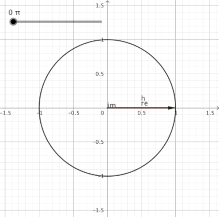

# An attempt to make sure that everybody actually understand the Fourier Transform

1.	Intention: Once, you are done reading this artice, as an author, I want to make sure that I truly put forth my \
	perception of the Fourier Transform. In order to do so, I'll digress from the actual topic and gradually will \
	make my way to the famous Fourier Transform Equation. Without any further a do, let's start the learning!

## Circle

1.	We'll start with circles, the very first question that comes to my mind when I think of circles is \
	"why do 360 degrees make up a circle?". Well, one possible explanation is **360 is the most composite number starting from 1 uptil 360**.\
	So, what a composite number is? Hmm, a prime number is something that is divisible only by itself and one. However,
	**a composite number is something that is divisible by itself, one and some other numbers as well**. 

2.	These are the numbers 360 is divisible by:
		
		1,2,3,4,5,6,8,9,10,12,15,18,20,24,30,36,40,45,60,72,90,120,180 and 360
		
3.	360 being a very composite number simplifies a lot of our calculations. Humans are very good at dealing with **Integer values**, hence, this could be a possible reason for a circle to have 360 degrees

## cosΘ and sinΘ

1.	Now that we understand "why circle has 360 degrees?". Let us now see "what role do cosΘ and sinΘ play?" Before I talk about their roles, let us have a look at these values first that most of us have been taught since primary school.
	

2.	Okayyy! The question here is "where do these values come from?". Hmmm, interesting! So, imagine if you have a unit circle, basically a circle whose radius is 1 units and you make one complete revolution(rotate 360 degrees) starting from the point (1,0) **then** every point (x,y) on the circumference of the unit circle represent values of (cosΘ,sinΘ), whoaaa, really?? Let's rephrase it! \
	Simply speaking, **cosΘ represents all x-values in the cartesian plane** and **sinΘ represents all y-values in the cartesian plane**. Hence, at Θ=30, *cos30=0.866* is the distance of point (x,y) from the origin, in the x-direction. Similarly, *sin30=0.5* is the distance of point (x,y) from the origin, in the y-direction.
	

## Complex Plane

1.	Great!! We now understand a circle and how cosΘ and sinΘ are related to it! Now, let us tackle a not so interesting topic i.e. **The complex plane**
2.	Look at this equation:
		
		x² + 1 = 0
		
	What are the roots of it? Can't answer, right?! This literally put a stop to our mathematics a few hundred years back, quite a lot of problems became unsolvable just because of this equation. Whoa!! how can the math stop, right???! This equation showed us that our mathematics of that time was missing a concept. So, as an answer to it some smart person came up with the idea of **Imaginary Numbers** which basically represents **√-1 as i, called IOTA** \
	√-1 = i, √-2 = 2i, √-3 = 3i, √-4 = 4i.
3.	But, the question is 'what makes them imaginary??!!'. To answer this question, I would like to inform you that **before complex numbers were discovered, we only had the real number system**. So, 'what made up the real number system?' Let's have a look at it!
	
		Natural Numbers: 		1,2,3,4,5 (only positive numbers)
		
		Whole Numbers: 			0,1,2,3,4,5 (includes zero as well)
		
		Integers:				-2,-1,0,1,2	(includes negative as well positive numbers)
		Fractions:				-2/4, -1/2, 0/2, 0.3333, 0.5 (includes terminating or non-terminating repeating numbers)
		
		Rational Numbers:		Natural, Whole, Integers, Fractions, all make up the rational number system
		Irrational Numbers:		Non-terminating, non-repeating numbers basically --- √2, π
		
	From the above information, we can say that:
		
		Natural numbers are a SUBSET of Whole numbers
		
		Whole numbers are a SUBSET of Integers
		
		Integers are a SUBSET of Rational numbers
		Fractions are a SUBSET of Rational numbers
		
		Rational numbers are a SUBSET of Real Numbers
		Irrational numbers are a SUBSET of Real Numbers

	This entire system of numbers is called **The Real Number System**
	
4.	Still, 'What are imaginary numbers then??!!'. Okay, calm down! Let us understand just one property and then I'll explain imaginary numbers.
	The property is: **If you multiply a non-negative number with itself, you get a POSITIVE number**. Whoaa! what??! Okay let's see. 
	
		Multiply 0 with 0, you get 0 (whole numbers)
		Multiply -1 with -1, you get 1 (integers)
		Multiple 2/5 by 2/5, you get 4/25 (terminating fractions)
		Multiply √3 by √3, you get 3 (irrational numbers)
		Multiply 0.3333 by 0.3333, you get 0.1111 (non-terminating fractions)
		
	Got it! So, what?\
	Well, now multiply √-3 by √-3, you get -3. OMG, this actually doesn't comply with the real number system!
	Hence, these numbers aren't a part of the real number system and **they are called imaginary numbers only for our convenience because intuitively its easy for us to imagine that way**

5.	Also, **any point: (x,y)** in the cartesian plane can be represented in the complex plane as **x + iy**. Having said this, let us now come back to our unit circle. As I said earlier, **any point: (x,y) on the circumference of a unit circle could also be expressed as (cosΘ, sinΘ)**. So, 'how will we represent these points in the complex plane?' \
	Simple, as follows: **cosΘ + i sinΘ**. This is also called the **Euler's Identity**

### credits

1.	unit circle: https://www.wikiwand.com/en/Unit_circle

# Concepts to understand

1.	Euler's Identity

2.	Equation of circle

3.	With only natural numbers, x+1=0 would be unsolvable, unless we introduce integers. \
	Now, despite the knowledge of both natural numbers and integers, the equation 2x-1=8 \
	would be unsolvable without introducing rational numbers. \
	The equation x^2=3 would be unsolvable without irrational numbers. \
	And finally, x^2+1=0 would be unsolvable without imaginary numbers.

4.	A peculiar pattern can be observed each time we multiply a real number with i \
	Graphically, the product x.i.i.i...represents a counterclockwise rotation \
	of a vector of size x by 90ยบ each time an i is multiplied to it. \
	If we assume the value of x to be 1, only 4 vectors repeatedly emerge: \
	i, -1, -i and 1; a quarter of a circle, a semi-circle, a three-quarter circle and a full circle. \
	
5.	360 is highly composite

6.	Pythagoras Theorem is basically point in a plane
	-	distance along x-axis (cos) + distance along y-axis (sin)
	
7.	Pythagoras theorem is used to find the radius of the circle whose center is at the origin \
	or you could say it is used to find the distance of a point from the origin. \
	Hence, the equation of the circle and the distance formula are nothing but **Pythagoras Theorem**

1.	a co-ordinate pair is unitless

2.	euler's identity uses the complex plane to display a point on a circle

3.	a point within a 2D image 

4. 	the circle rotates at a particular frequency, for this frequency find the position of point \
	for each time sample.